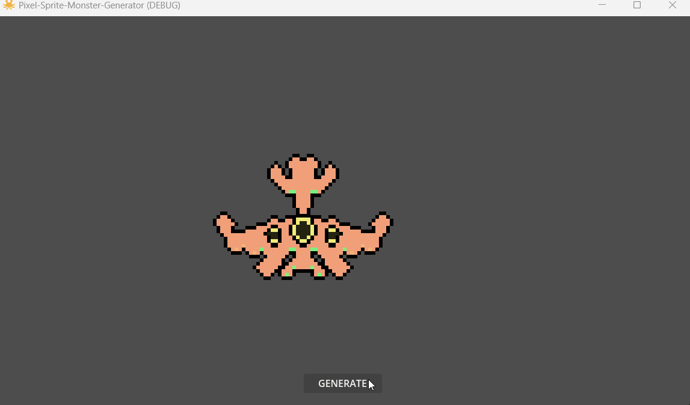
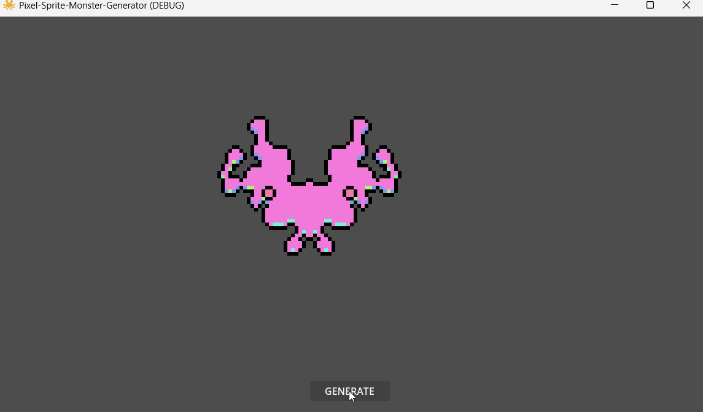

	

<h3 align="center">Pixel monster sprite generator</h3>

  

   Port to Godot 4 for the pixel sprite generator by deep-fold
	 
	·
	<a href="https://github.com/ninetailsrabbit/pixel-sprite-monster-generator/issues/new?assignees=ninetailsrabbit&labels=%F0%9F%90%9B+bug&projects=&template=bug_report.md&title=">Report Bug</a>
	·
	<a href="https://github.com/ninetailsrabbit/pixel-sprite-monster-generator/issues/new?assignees=ninetailsrabbit&labels=%E2%AD%90+feature&projects=&template=feature_request.md&title=">Request Features</a>
  

 
 

- [📦 Installation](#-installation)
- [Getting started 🚀](#getting-started-)
  - [Features 👾](#features-)
  - [Not included yet 🗒️](#not-included-yet-️)
- [Animated Showcase](#animated-showcase)
- [Static showcase](#static-showcase)

# 📦 Installation

1. [Download Latest Release](https://github.com/ninetailsrabbit/pixel-sprite-monster-generator/releases/latest)
2. Unpack the `addons/ninetailsrabbit.pixel-sprite-monster-generator` folder into your `/addons` folder within the Godot project
3. Enable this addon within the Godot settings: `Project > Project Settings > Plugins`

To better understand what branch to choose from for which Godot version, please refer to this table:
|Godot Version|pixel-sprite-monster-generator Branch|pixel-sprite-monster-generator Version|
|---|---|--|
||`4.3`|`1.x`|
||`main`|`1.x`|

# Getting started 🚀

This project brings the [Pixel sprite generator](https://deep-fold.itch.io/pixel-sprite-generator) created by the user [Deep-Fold](https://github.com/Deep-Fold) to the Godot 4 version.

## Features 👾

- **Create monsters directly in your scene:** Generate unique pixel art monsters at runtime using a dedicated node in your Godot scene tree.
- **Customize with ease:** Exportable parameters allow you to fine-tune the monster generation process, tailoring them to your specific needs.
- **One node, one monster:** Each node represents a single monster, making your scene organization and workflow efficient

## Not included yet 🗒️

- **_Monster preview in the editor_**
- **_Export to image_**

# Animated Showcase

# Static showcase

